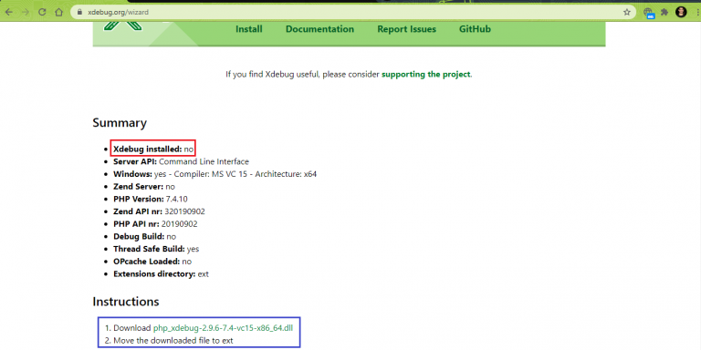
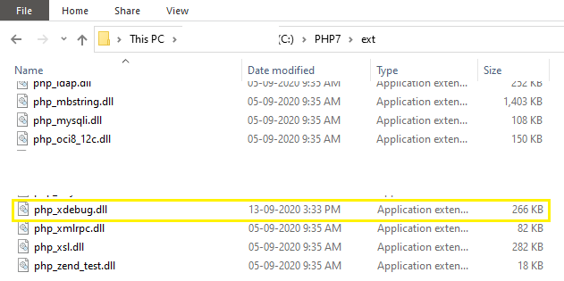
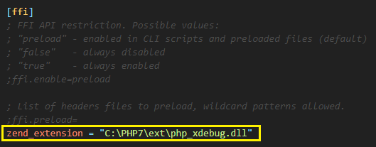
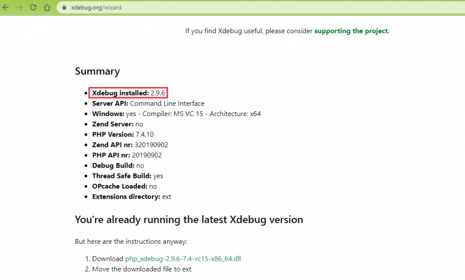
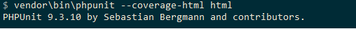

# PHP UNIT - COVERAGE

# How to set-up coverage in PHP
## 1. Install phpunit/phpunit
`composer require phpunit/phpunit`
## 2. Install phpunit/php-code-coverage
`composer require phpunit/php-code-coverage`
## 3. Create folder structure for testing
- ./src/ _(contain php classes)_
- ./tests/ _(contain php testing classes)_
- ./html/ _(contain coverage report files)_
## 4. Download file php_xdebug.dll
Check php xdebug and download suitable version
- Step 1 : `php -i > phpinfo.txt`
- Step 2 : For enabling support for Xdebug in the framework, download the appropriate DLL as mentioned in the ‘Instructions’ section in https://xdebug.org/wizard.

  
- Step 3 : Download the latest Xdebug DLL file for PHP from here. The DLL being suggested can differ based on the configuration of the machine where PHP is installed. 
- Step 4 : Move the downloaded DLL file to the ‘ext’ folder of the PHP installer. We have renamed the DLL to php_xdebug.dll.

  
- Step 5 : Modify c:\PHP\php.ini by adding the entry of Xdebug DLL in zend_extension

  
- Step 6 : With this, the Xdebug support is enabled. To confirm, execute the command php –i > < some_text_file_2 > and paste the contents of the text file in https://xdebug.org/wizard. As seen in the ‘PHP Info Summary,’ it is confirmed that Xdebug support is enabled for PHPUnit installed on our machine:

  
- Step 7 : The execution of command vendor\bin\phpunit --coverage-html <directory> on the terminal now indicates that ‘code coverage driver is available’.

  
## 5. Turn on xdebug.mode
In file php.init, add new line:
- `xdebug.mode=develop,debug,coverage`
## 6. Create file phpunit.xml
```html
<?xml version="1.0" encoding="UTF-8"?>
<phpunit colors="true">
    <php>
        <env name="XDEBUG_MODE" value="coverage"/>
        <ini name="xdebug.mode" value="coverage"/>
    </php>
    <testsuites>
        <testsuite name="Application Test Suite">
            <directory>./tests/</directory>
        </testsuite>
    </testsuites>
    <filter>
        <whitelist processUncoveredFilesFromWhitelist="true">
            <directory suffix=".php">./src</directory>
        </whitelist>
    </filter>
</phpunit>
```
## 7. Test
- Show on console:
`.\vendor\bin\phpunit --coverage-text`
- Show on website
`.\vendor\bin\phpunit --coverage-html html`
